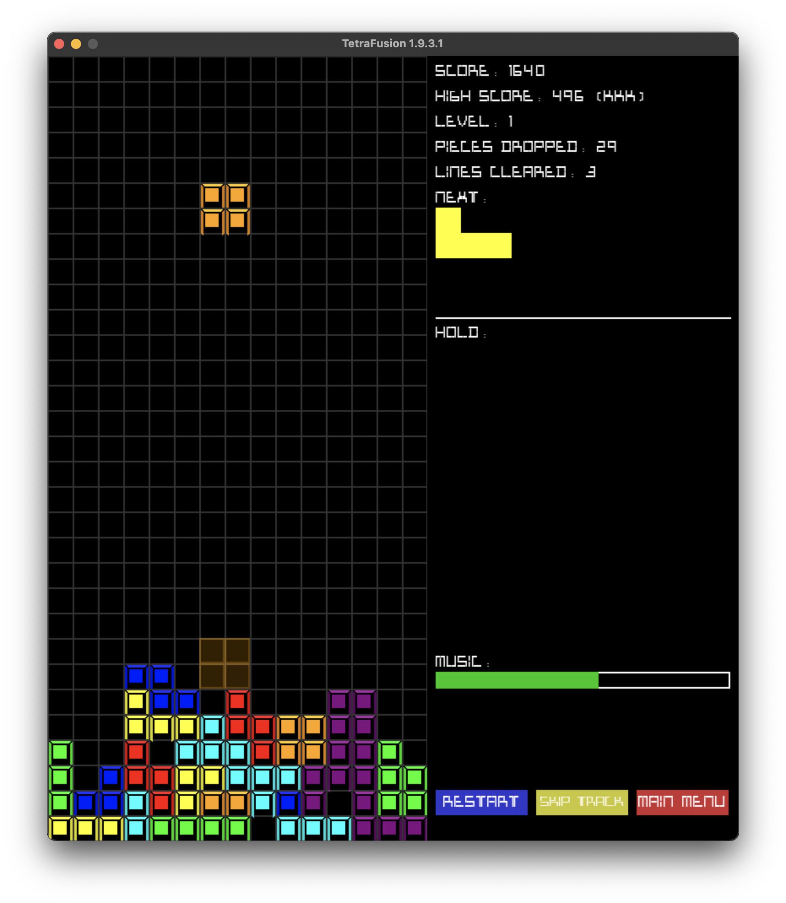

**TetraFusion** is a modern take on the classic Tetris game, implemented using Python and Pygame. This version introduces new difficulty settings, enhanced particle effects, an improved in-game interface, and expanded custom music support while keeping the timeless Tetris feel.

---

## Features

- **2.5D Block Rendering**: Blocks are rendered with a 3D-like perspective.
- **Dynamic Particle Effects**: Enjoy visually engaging effects such as flame trails, explosions, and dust particles when blocks are placed.
- **Music and Sound Effects**: Enhance your gameplay with background music and sound effects.
- **Expanded Custom Music Playlist Support**:
  - Select a directory with supported audio files (.mp3, .wav, .flac, .ogg, .aac, .m4a, or .wma).
  - Uses Mutagen for audio verification.
  - Includes track-skipping functionality.
- **Ghost Piece (Drop Shadow)**: See where the tetromino will land with a transparent ghost piece and a shadow reflection effect.
- **Hold Piece Mechanic**: Save a tetromino for later use to strategize your moves.
- **High Score Tracking**: Save and load high scores along with player initials.
- **Customizable Settings**: Adjust key bindings, grid opacity, difficulty (including a new "Very Hard" mode), and more via an in-game options menu.
- **Joystick & Gamepad Support**: Navigate menus and play the game using a joystick or gamepad.
- **Subwindow with Stats & Controls**: View real-time game statistics, volume control, and track skipping options.
- **Tetris Flash Effect**: A special flash effect triggers when clearing four lines.

---

## Requirements

- **Python 3.7+**
- **Pygame 2.0+**
- **Mutagen (for audio metadata support)**
- **Pyobjc (for macOS support)**

Install dependencies using:

    python3 -m pip install -r requirements.txt

---

## Installation

1. **Clone the repository:**

   ```sh
   git clone https://github.com/XxUnkn0wnxX/TetraFusion.git
   cd TetraFusion
   ```

2. **Ensure the required assets are in place:**

   - **Fonts:**  
     Place `tetris-blocks.TTF` in the `assets` directory.
   
   - **Audio Files:**  
     Place the following in the `Audio` directory:
     - `Background.ogg`
     - `Lineclear.ogg`
     - `MultipleLineclear.ogg`
     - `GAMEOVER.ogg`
     - `heartbeat_grid_almost_full.ogg`

---

## How to Run

Run the main script using:

    python "TetraFusion.py"

---

## Controls

- **Arrow Keys**: Move and rotate the tetromino.
- **Space**: Hard drop.
- **P**: Pause the game.
- **R**: Restart the game.
- **M**: Return to the main menu.
- **Enter**: Start the game from the main menu.
- **Hold (default: C)**: Hold the current tetromino for later use.
- **Mouse Click (Subwindow)**: Adjust volume, skip tracks, or interact with on-screen buttons.
- **Gamepad Support**: Joystick navigation and button mapping for key actions.

### Screens Overview

- **Main Menu**:  
  Displays the title and instructions for starting the game or accessing the options menu.
  
- **Gameplay**:  
  Features the grid, real-time score, level, lines cleared, next tetromino preview, and hold piece display.
  
- **Options Menu**:  
  Customize controls, difficulty, grid opacity, visual effects, and music settings (including custom playlist selection).
  
- **Pause Screen**:  
  Halts the game and displays a resume prompt.
  
- **Game Over Screen**:  
  Shows your final score and lets you enter your initials if a new high score is achieved.

---

## Customization

### Modify Colors

To change tetromino colors, edit the `COLORS` list in the script:

```python
COLORS = [
    (0, 255, 255), (255, 165, 0), (0, 0, 255),
    (255, 0, 0), (0, 255, 0), (255, 255, 0), (128, 0, 128)
]
```

### Adjust Grid Settings

- **Grid Opacity & Lines:**  
  In the options menu, adjust the grid opacity (0 for invisible up to 192 for semi-transparent) and toggle grid lines on or off.
  
- **Grid Size:**  
  Modify these constants to change the dimensions:

```python
SCREEN_WIDTH = 450  
SCREEN_HEIGHT = 930  
BLOCK_SIZE = 30
```

### Replace Audio

Swap out the audio files in the `Audio` directory with your own .ogg files to change the background music or sound effects.

### Enable Custom Music Playlist

In the options menu, select a folder containing supported audio files to enable a custom music playlist. Now supports track-skipping and file verification using Mutagen.

---

## High Score System

High scores are stored in `high_score.txt` using the format:

    <score> <initials>

If the file does not exist, it will be created automatically.

---

## Screenshots



---

## Contributing

Contributions are welcome! Follow these steps:

1. **Fork the repository.**
2. **Create a new branch:**

   ```sh
   git checkout -b feature-name
   ```

3. **Commit your changes:**

   ```sh
   git commit -m "Add feature-name"
   ```

4. **Push to your branch:**

   ```sh
   git push origin feature-name
   ```

5. **Open a pull request.**

---

## License

This project is licensed under the MIT License. See the LICENSE file for details.

MIT License

Permission is hereby granted, free of charge, to any person obtaining a copy  
of this software and associated documentation files (the "Software"), to deal  
in the Software without restriction, including without limitation the rights  
to use, copy, modify, merge, publish, distribute, sublicense, and/or sell  
copies of the Software, and to permit persons to whom the Software is  
furnished to do so, subject to the following conditions:

THE SOFTWARE IS PROVIDED "AS IS", WITHOUT WARRANTY OF ANY KIND.

---

## Acknowledgments

- Inspired by the classic Tetris game.
- Thanks to the Pygame community for their continuous support and resources.
- OpenAI For Code Fixes & Refactoring
